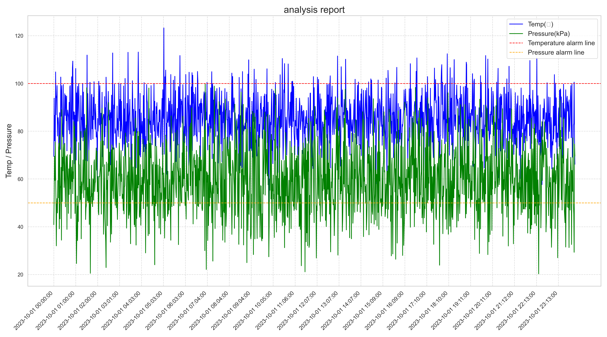

# Equipment Monitoring and Alert System

This project is a Python-based equipment monitoring and alert system that analyzes equipment logs, detects anomalies, generates visual reports, and sends email notifications when irregularities are found.

## Features

- **Data Analysis**: Cleans data, identifies anomalies in temperature and pressure, and generates visual reports.
- **Email Alerts**: Sends email notifications with attached reports when anomalies are detected.

## Installation

1. Clone the repository:
   ```bash
   git clone https://github.com/your_username/equipment-monitoring.git
   cd equipment-monitoring
   ```
2. Install the required packages:
   ```bash
   pip install -r requirements.txt
   ```

## Configuration

Configure your email settings in the `config.ini`.

### Example `config.ini`:

```ini
[EMAIL]
sender = your_email@example.com
password = your_email_password
receiver = receiver_email@example.com
smtp_server = smtp.example.com
smtp_port = 587
```

## Usage

1. **Run the Script**:
   ```bash
   python data_analyzer.py
   ```

## Output

- The script will generate a report image (`report_YYYYMMDD.png`) visualizing temperature and pressure trends.
- If anomalies are detected, an email with the report attached will be sent to the configured recipient.

## Customization

- **Thresholds**:
  - Temperature alarm threshold: 100℃
  - Pressure alarm threshold: 50 kPa
    Adjust these in the `analyze_data` function if needed.

## Output

- The script will generate a report image (`report_YYYYMMDD.png`) visualizing temperature and pressure trends.
- If anomalies are detected, an email with the report attached will be sent to the configured recipient.

### Example Report


